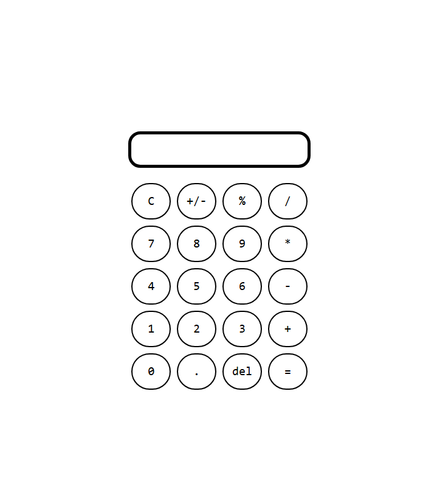

# The Odin Project: Calculator
---
This project is the capstone project for [The Odin Project's website](https://www.theodinproject.com/about) Foundations course. It is a culmination of all of the topics that I have learned throughout. From basic HTML to advanced Javascript expressions.

The calculator was made up of a container div for everything, a display div, and various buttons inside of a div for the operators and numbers. I used Flexbox in order to get the layout of the buttons correctly spread and grown to fit its div container. I added css to make the calculator look more unique including a hover effect for the buttons. Finally to make the calculator actually work, I used two stacks, one for the numbers and one for the operators.

Even though I already had some basic understanding of HTML, CSS, and Javascript coming into this course, I was still able to learn a lot of new things both practically and conceptually. 

